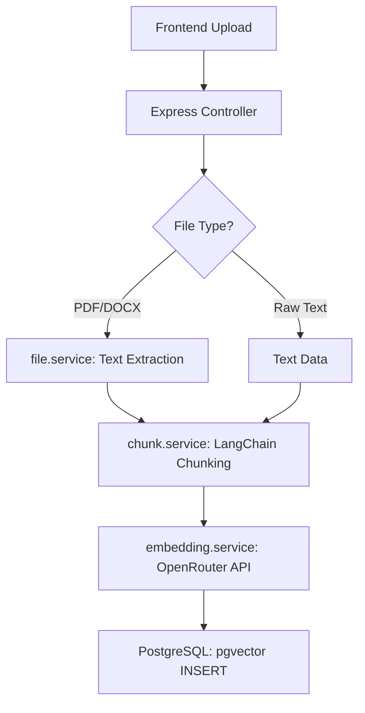
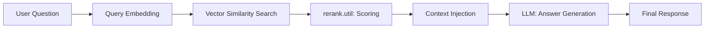

# RAG Platform: Developer Workflow Documentation

This document provides a technical deep-dive into the architecture, data pipelines, and infrastructure of the RAG (Retrieval-Augmented Generation) Platform.

---

## 🏗 System Architecture

The project consists of a **Next.js Frontend** and an **Express.js Backend**, with **PostgreSQL** serving as the vector database.

- **Frontend**: Next.js 16 (App Router), Tailwind CSS 4, Framer Motion.
- **Backend**: Node.js/Express in ESM mode.
- **Database**: PostgreSQL with `pgvector` extension for high-performance vector similarity search.
- **LLM/Embeddings**: OpenRouter API (GPT and text-embedding-3 models).

---

## 📥 1. The Ingestion Pipeline (Write Path)

This process converts unstructured data into searchable vector chunks.

### Workflow
1. **Extraction**: `file.service.ts` identifies the mimetype (PDF, DOCX, TXT) and extracts raw text. 
   - *Note*: PDF parsing uses a class-based `PDFParse` API (v2.4.x) with custom polyfills.
2. **Chunking**: `chunk.service.ts` utilizes LangChain's `RecursiveCharacterTextSplitter` to break text into manageable chunks (default: 1000 chars with 200 overlap).
3. **Embedding**: `embedding.service.ts` sends each chunk to the Embedding API (OpenRouter) to generate a 1536-dimensional vector.
4. **Storage**: `index.pipeline.ts` performs an `INSERT` into the `documents` table, storing the raw content, user context, and the vector embedding.

---

## 🔍 2. The RAG Pipeline (Read Path)

This process answers user questions using the indexed knowledge base.

### Workflow
1. **Query Embedding**: The user's question is converted into a vector using the same embedding model as ingestion.
2. **Similarity Search**: `rag.pipeline.ts` executes a cosine similarity search against the `documents` table using `pgvector`.
3. **Scoring & Reranking**: `rerank.util.ts` applies a custom word-match scoring algorithm to the top retrieved chunks to prioritize relevance.
4. **Context Injection**: The top 5 relevant chunks are joined into a context string.
5. **LLM Generation**: `llm.service.ts` sends the context + question to the LLM. The model is instructed to *only* use provided context or say "I don't know".

---

## 🛠 Infrastructure & "Gotchas"

As a developer, be aware of these specific environment fixes implemented to maintain stability:

### 1. Host Binding (Connectivity)
In `server.ts`, the backend is explicitly bound to `0.0.0.0` rather than just `localhost`. This resolves IPv4/IPv6 ambiguity in Node.js v17+ which frequently causes "Network Error" in the browser.

### 2. Node.js Polyfills
Located in `src/polyfills.ts`, these are loaded **first** in `server.ts` to support modern PDF parsing in Node:
- **DOMMatrix**: Required by `pdfjs-dist` v5+.
- **ImageData / Path2D**: Mocked to prevent rendering-related crashes.
- **process.getBuiltinModule**: Polyfilled for Node < v20.16.0 compatibility.

### 3. CORS Hardening
CORS is explicitly configured in `app.ts` to allow `http://localhost:3000` with `credentials: true`, ensuring multipart document uploads work across origins.

---

## 🚀 Setup & Development

### Environment Variables (.env)
Required keys in `/backend/.env`:
- `DATABASE_URL`: PostgreSQL connection string.
- `OPENROUTER_API_KEY`: For embeddings and LLM.
- `PORT`: (Optional) Defaults to 5001.

### Commands
- **Backend**: `npm run watch` (Starts `tsc -w` and `nodemon`).
- **Frontend**: `npm run dev` (Starts Next.js).
